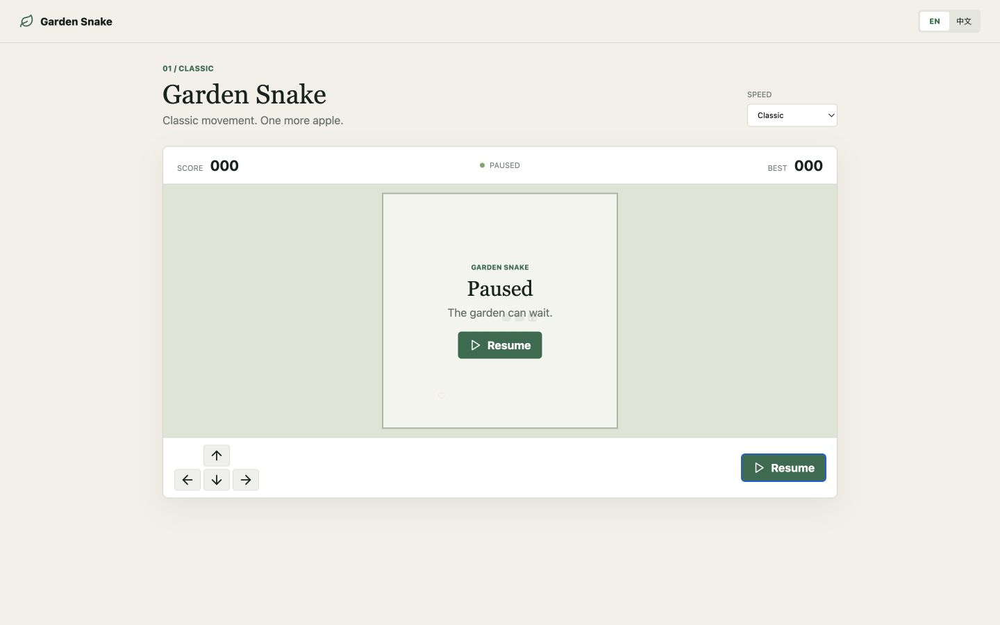

# 花园贪吃蛇

<!-- repo-languages:start -->
[English](README.md) | 简体中文
<!-- repo-languages:end -->

<!-- repo-badges:start -->

<!-- repo-badges:end -->

经典贪吃蛇的精致浏览器版本，支持键盘和触控操作、三种速度、暂停继续，以及保存在本地的最高分。

[开始游戏](https://shenzhepei.github.io/game-snake/)

## 功能

- 稳定可测试的经典规则，包含撞墙和碰撞自身判定
- 悠闲、经典和极速三种速度
- 方向键、WASD 与触控操作
- 完整的暂停、继续、重开与结束状态
- 最高分保存在当前浏览器
- 完整适配桌面和移动端的中英文界面

## 本地开发

需要 Node.js 24 和 pnpm 10.33.2。

    corepack enable
    pnpm install
    pnpm dev

运行生产构建与测试：

    pnpm build
    pnpm test:coverage

## 许可证

MIT。原项目 2020 年的版权声明保留在 [LICENSE](LICENSE) 中。
